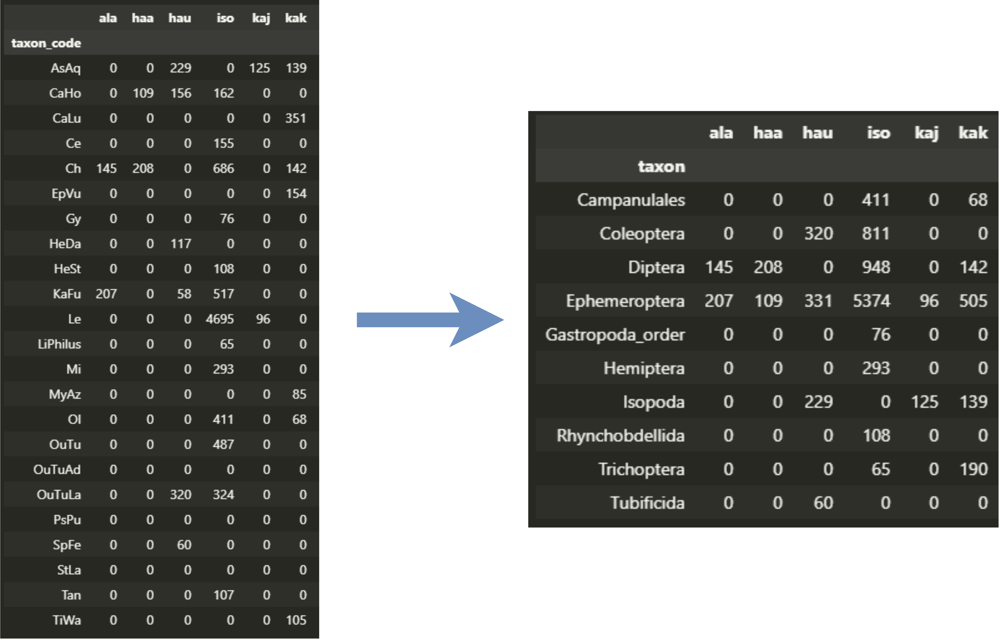
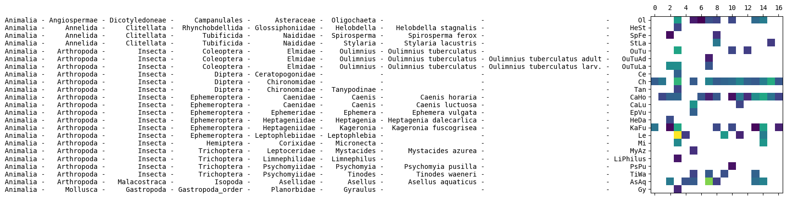

# tiers
A hierarchical label handling library for Python

# Installation

You can install tiers using pip:

```bash
pip install git+https://github.com/mikkoim/tiers.git
```

For the latest version, install the dev branch:

```bash
pip install https://github.com/mikkoim/tiers/archive/dev.zip
```

# Examples

See the [demo notebook](docs/demo.ipynb) for more details.

## Creating a tiers Tree from a Pandas DataFrame:
```python
import pandas as pd
from tiers import Tree

# Sample DataFrame with hierarchical data
data = {
    "Level1": ["A", "A", "B", "B", "B"],
    "Level2": ["A1", "A2", None, "B2", "B3"],
    "Level3": ["A1a", "A2b", None, None, "B3c"],
    "Label": ["Label1", "Label2", "Label3", "Label4", "Label5"]
}
df = pd.DataFrame(data)

# Create a Tree object from the DataFrame
tree = Tree.from_dataframe(df, set_root=True)

# Show the tree
tree.show()
# root
# ├── A
# │   ├── A1
# │   │   └── A1a
# │   └── A2
# │       └── A2b
# └── B
#     ├── B2
#     └── B3
#         └── B3c
```

## Mapping labels to nodes at a specific level

```python
# Map labels to nodes at a specific level
mapped_nodes = tree.map(["Label1", "Label2", "Label3", "Label4", "Label5"],
                        level="Level2")
print(mapped_nodes)  # Output: ['A1', 'A2', 'B', 'B2', 'B3']

# Mapping can be also done stricty on specific level
level3_labels = tree.map(["Label5", "Label4", "Label3"],
                        level="Level3",
                        strict=True)
print(level3_labels) # Output: ['B3c', None, None]
```

## Setting the tree to a level and mapping labels to it
```python
tree.set_level("Level1")
mapped_nodes = tree.map(["Label1", "Label2", "Label3", "Label4", "Label5"])
print(mapped_nodes) # Output: ['A', 'A', 'B', 'B', 'B']
```

## Regrouping pandas dataframes
```python
level="order"
grouped = df.assign(taxon=tree.map(df.index, level=level)).groupby("taxon").sum()
```


Extending a label into a `pandas.MultiIndex` is also supported.

## Extending formatted label strings for plotting

```python
import matplotlib.pyplot as plt
plt.rcParams["font.family"] = "monospace" # Make labels align properly
df = df.loc[tree.sort_labels(df.index)] # Sort the labels based on the hierarchical order

fig, ax = plt.subplots()
ax.matshow(df) 

# Tiers works here. Padding is set automatically:
extended_labels = tree.extend_labels(df.index, return_string=True, pad=True)

# Set the labels
ax.set_yticks(range(len(df.index)), # Tick locations
              labels=extended_labels)
plt.show()
```


Subsets of columns can also be selected.

## Finding the Lowest Common Ancestor for two nodes:

```python
# Find the Lowest Common Ancestor (LCA) of two nodes
print(tree.lca("Label2", "Label4")) # Output: 'root'
print(tree.lca("Label1", "Label2")) # Output: 'A'
```

See the [demo notebook](docs/demo.ipynb) for more details.


# Acknowledgements

This library uses the excellent [`bigtree`](https://github.com/kayjan/bigtree) library, which provides support for handling tree structures.

# Contributing

Contributions are welcome! If you encounter any issues or have suggestions for improvements, please feel free to open an issue or submit a pull request. The library is still under heavy development and breaking changes can be introduced.
